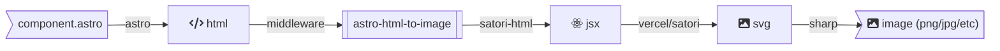

> ⚠️ **WORK IN PROGRESS**: This package requires changes[^filename-change] in Astro before it will be useable. Sit tight!

# astro-html-to-image

This is an [Astro middleware](https://docs.astro.build/guides/middleware/) that allows you to easily render Astro components to images.

# Prerequisites

- This middleware is for [Astro](https://astro.build).
- Node.js: [`sharp`](https://github.com/lovell/sharp) is used to convert svg to images and is a hard dependency. Since `sharp` does not run in all edge runtimes, you must be building/serving your Astro site using Node.js. Feel free to open a PR replacing `sharp` with some wasm library that runs everywhere if you can find one.

# Installation

In your existing Astro project:

```sh
# Using NPM
npm install @altano/astro-html-to-image
# Using Yarn
yarn add @altano/astro-html-to-image
# Using PNPM
pnpm add @altano/astro-html-to-image
```

# Setup

Create a `middleware.ts` file[^middleware-docs] if you haven't already. `middleware.ts`:

```ts
import { createHtmlToImageMiddleware } from "@altano/astro-html-to-image";

export const onRequest = createHtmlToImageMiddleware({ ... });
```

Create a component to convert to an image. It must have a ".format.astro" extension, e.g. if you are creating png images your component must end in ".png.astro". `image.png.astro`:

```astro
<html><body>Hello!</body></html>
```

Astro, by default, tries to bundle middleware. Unfortunately, `sharp` (used by this plugin) is not ESM compatible, and trying to bundle it will result in errors. [Disable middleware bundling in your Astro config](https://docs.astro.build/en/reference/configuration-reference/#buildexcludemiddleware) to make this work:

```ts
// https://astro.build/config
export default defineConfig({
  // ...
  build: {
    excludeMiddleware: true,
  },
});
```

NOTE: Your Astro component must be HTML elements and styles [supported by Satori](https://github.com/vercel/satori#jsx), e.g. it can't be stateful or use `calc()` in css. The [OG Image Playground](https://og-playground.vercel.app/) is a great place to test your component before copying it into your Astro project.

# Example Usage

`middleware.ts`:

```ts
import { createHtmlToImageMiddleware } from "@altano/astro-html-to-image";

export const onRequest = createHtmlToImageMiddleware({
  format: "png",
  async getSatoriOptions() {
    const interRegularBuffer = await fetch(`https://rsms.me/inter/font-files/Inter-Regular.woff`).then((res) => res.arrayBuffer());
    return {
      width: 800,
      height: 200,
      fonts: [
        {
          name: "Inter Variable",
          data: interRegularBuffer,
          weight: 400,
          style: "normal",
        },
      ],
    };
  },
});
```

`image.png.astro`:

```astro
---
/**
 * This is not used during image generation. It is only here
 * to make the fonts consistent between the generated image
 * and how the component is rendered if the image generation
 * middleware is disabled.
 */
import "@fontsource-variable/inter";
---

<html>
  <body
    style=`font-family: "Inter Variable";
           background: white;
           height: 100vh;
           width: 100vw;
           display: flex;
           flex-direction: column;
           align-items: center;
           justify-content: center;`
  >
    <h1
      style="font-weight: 800;
             font-size: 5rem;
             margin: 0;"
    >
      Kurt's Website!
    </h1>
    <p style="font-weight: 400;
              font-size: 2rem;">
      This is rendered as a PNG image.
    </p>
  </body>
</html>
```

See https://github.com/altano/npm-packages/tree/main/examples/astro-html-to-image for a slightly more involved example.

# Options Reference

`createHtmlToImageMiddleware` requires the following options:

- `format`: Any output format that the sharp library accepts, as a string, e.g. "avif", "jpg", "png", "webp", "gif", etc.
- `getSatoriOptions`: Options that the vercel/satori library accepts. At the very least, you must specify dimensions and one font to use.

See the TypeScript type-hints and comments for more info.

# Recipes

## Using Custom Fonts

`middleware.ts`:

```ts
import { createHtmlToImageMiddleware } from "@altano/astro-html-to-image";

export const onRequest = createHtmlToImageMiddleware({
  format: "png",
  async getSatoriOptions() {
    const interRegularBuffer = await fetch(`https://rsms.me/inter/font-files/Inter-Regular.woff`).then((res) => res.arrayBuffer());
    const interBoldBuffer = await fetch(`https://rsms.me/inter/font-files/Inter-Bold.woff`).then((res) => res.arrayBuffer());
    return {
      width: 800,
      height: 200,
      fonts: [
        {
          name: "Inter Variable",
          data: interRegularBuffer,
          weight: 400,
          style: "normal",
        },
        {
          name: "Inter Variable",
          data: interBoldBuffer,
          weight: 800,
          style: "normal",
        },
      ],
    };
  },
});
```

## Converting Multiple Image Types

`middleware.ts`:

```ts
import { sequence } from "astro/middleware";
import { createHtmlToImageMiddleware } from "@altano/astro-html-to-image";

import type { SatoriOptions } from "@altano/astro-html-to-image";

async function getSatoriOptions(): Promise<SatoriOptions> {
  // ...
}

const pngMiddleware = createHtmlToImageMiddleware({
  format: "png",
  getSatoriOptions,
});

const jpgMiddleware = createHtmlToImageMiddleware({
  format: "jpg",
  getSharpOptions: async () => ({ quality: 1, effort: 1 }),
  getSatoriOptions,
});

export const onRequest = sequence(pngMiddleware, jpgMiddleware);
```

## Using Frameowork Components (e.g. React or Svelte)

See [the React component example](https://github.com/altano/npm-packages/blob/main/examples/astro-html-to-image/src/pages/react.png.astro).

# How it Works

This library is a tiny wrapper around:

- [`satori-html`](https://github.com/natemoo-re/satori-html) (html -> jsx)
- [`vercel/satori`](https://github.com/vercel/satori) (jsx -> svg)
- [`sharp`](https://github.com/lovell/sharp) (svg -> png/jpg/etc)

The pipeline looks like this:



[^filename-change]: https://github.com/withastro/roadmap/discussions/643
[^middleware-docs]: https://docs.astro.build/guides/middleware
