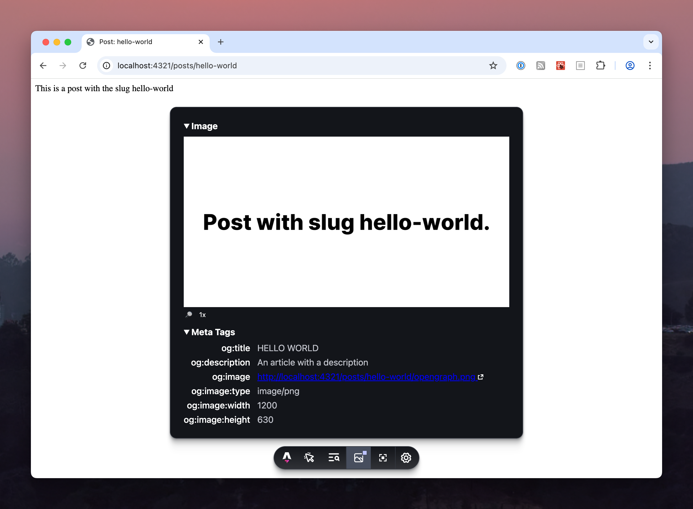

> ⚠️ **EXPERIMENTAL**: This package uses experimental Astro APIs. Tread carefuly. [More info below](#experimental-container-apis).

# astro-opengraph

Your Open Graph toolkit 🧰 for Astro, including everything you need to:

- Create Open Graph png image from .astro components.
- Manage your Open Graph meta tags (e.g. `<og:image>`, `<og:image:title>`, etc).
- Show you a page's Open Graph image and meta tags in `astro dev` mode with an Astro [dev toolbar app](https://docs.astro.build/en/guides/dev-toolbar/).
- Fit text to fill a space in your Open Graph image.
- Configure everything above with an [Astro integration](https://docs.astro.build/en/guides/integrations-guide/).

Unlike existing Astro integrations for Open Graph images, this one:

- Doesn't require browsers or screenshotting (e.g. using Puppeteer/Playwright). It's all Astro and Node.js native, so to speak.
- Can turn any .astro component into an Open Graph image. You don't need to use a preset template and you don't need to mess with html strings in a config file.
- Can re-use Astro components from elsewhere in your site.
- Can make use of Astro props or arbitrary JS in the script section of your template.

# Prerequisites

This integration is for [Astro](https://astro.build). If you aren't using Astro you're in the wrong place.

# Installation

In your existing Astro project:

```sh
# Using NPM
npx astro add @altano/astro-opengraph
# Using Yarn
yarn astro add @altano/astro-opengraph
# Using PNPM
pnpm astro add @altano/astro-opengraph
```

# Configuration

Configure the integration in your Astro config. You must at least provide some fonts to use (as there are no defaults), e.g. to use [Inter](https://rsms.me/inter) installed as an npm package:

```ts
export default defineConfig({
  integrations: [
    opengraphImage({
      async getImageOptions() {
        return {
          fonts: [
            {
              name: "Inter",
              path: "node_modules/@fontsource/inter/files/inter-latin-400-normal.woff",
              weight: 400,
              style: "normal",
            },
          ],
        };
      },
    }),
  ],
});
```

You can find full documentation for the configuration [below](#configuration-options-reference).

# Usage

## .astro Component

Create an Astro component to use as your Open Graph image. You can either:

1. Create the component outside the pages directory, e.g. `src/components/opengraph.astro` or
2. Create the component colocated with the endpoint you're going to serve it from, e.g. if the image route is `/blog/article-one/opengraph.png` you can store the component at `src/pages/blog/article-one/_opengraph.astro`. You must prefix the filename with an underscore ("\_") to prevent the .astro component from becoming its own html page.

Example `src/components/opengraph.astro` or `src/pages/_opengraph.astro`:

```astro
<html><body>Hello!</body></html>
```

[See below](#css-limitations-in-astro-template) for limitations on what you can/can't do in your component.

## Image Endpoint

In order serve the component from the prior step as an image, you need a js/ts [static file endpoint](https://docs.astro.build/en/guides/endpoints/#static-file-endpoints). You can use a static path or dynamic path. You can name the endpoint filename whatever you want as long as it has the extension `.png.ts`. For example:

`src/pages/opengraph.png.ts`:

```ts
import opengraphTemplate from "../components/opengraph.astro";
import { makeOpengraphEndpoint } from "@altano/astro-opengraph/endpoint";

export const GET = makeOpengraphEndpoint({
  template: opengraphTemplate,
});
```

## Meta Tags

You'll need `<meta>` tags that point to your Open Graph images from your pages. You can add these manually or you can use the included `<OpenGraphMeta />` component helper, e.g.:

```astro
---
import OpenGraphMeta from "@altano/astro-opengraph/components/meta.astro";
---

<html>
  <head>
    <OpenGraphMeta />
  </head>
  <body>
    <article><h1>Golfers and Conservatives – Why Control Was Right</h1></article>
  </body>
</html>
```

This would add the following tags to your `<head>`:

```html
<meta property="og:image" content="http://localhost/opengraph.png" />
<meta property="og:image:type" content="image/png" />
<meta property="og:image:width" content="1200" />
<meta property="og:image:height" content="630" />
```

You can use the `OpenGraphMeta` default props but you probably want to at least provide a `title`, `description`, and, if you used something other than `/opengraph.png.ts` (at the root) as your endpoint, you'll want to specify the path to the image endpoint with the `image` prop. For example:

```astro
---
import OpenGraphMeta from "@altano/astro-opengraph/components/meta.astro";
---

<html>
  <head>
    <OpenGraphMeta
      image="./opengraph.png"
      title="My Cool Website"
      description="A page on my website"
    />
  </head>
  <body>
    <article><h1>Golfers and Conservatives – Why Control Was Right</h1></article>
  </body>
</html>
```

You can also provide an `alt` prop which would set the `og:image:alt` meta tag, but my understanding is that it isn't well supported, so feel free to omit this.

If you want the `OpenGraphMeta` component to use a different set of defaults for your whole site, you can provide the `componentMetaTagFallbacks` integration config, e.g. to provide a default title:

```ts
export default defineConfig({
  integrations: [
    opengraphImage({
      componentMetaTagFallbacks: {
        "og:title": "My Cool Website",
      },
      async getImageOptions() {
        // ...
      },
    }),
  ],
});
```

If provided in the integration configuration like above, `<OpenGraphMeta />` will now use `"My Cool Website"` as the title default, but if given title via a prop, that will still take precedence.

## Putting That Altogether

Once you repeat the steps above for every Open Graph card you want to render, you might have something like this:

```
src/
├─ components/
│  │  ├─ opengraph-blog.astro
│  │  ├─ opengraph-root.astro
├─ pages/
│  │  ├─ opengraph.png.ts (imports ../components/opengraph-root.astro)
│  ├─ blog/
│  │  ├─ [...slug]/
│  │  │  ├─ index.astro
│  │  │  ├─ opengraph.png.ts (imports ../../../components/opengraph-blog.astro)
```

Or, if you decided to colocate the .astro templates in the pages directory, you might have something like this:

```
src/
├─ pages/
│  ├─ _opengraph.astro
│  ├─ opengraph.png.ts (imports ./_opengraph.astro)
│  ├─ blog/
│  │  ├─ [...slug]/
│  │  │  ├─ index.astro
│  │  │  ├─ _opengraph.astro
│  │  │  ├─ opengraph.png.ts (imports ./_opengraph.astro)
```

# Configuration Options Reference

The integration requires the following options:

- `getImageOptions.fonts`: an array of fonts that will be used in your image component. Each font requires:
  - `name`: This is whatever you reference in your css, e.g. `Inter`
  - `path`: A string path to your font file. Can be in your node_modules folder, e.g. `"node_modules/@fontsource/inter/files/inter-latin-400-normal.woff"`
  - `weight`: A weight, from 100 to 900. You can provide different fonts for different weights.

You may also want to provide defaults to be used by the `OpenGraphMeta` component in your `astro.config.ts` file. These are the defaults you can set:

- `componentMetaTagFallbacks["og:title"]`: the default title to use in the `OpenGraphMeta` component if none is passed in. The integration otherwise defaults to no title.
- `componentMetaTagFallbacks["og:description"]`: the default description to use in the `OpenGraphMeta` component if none is passed in. The integration otherwise defaults to no description.
- `componentMetaTagFallbacks["og:image"]`: the default image path to use in the `OpenGraphMeta` component. The integration otherwise defaults to `"/opengraph.png"`

See the TypeScript type-hints and comments for more info.

# Examples

## Using custom fonts

Run `npm install @fontsource/inter`, then:

`astro.config.ts`:

```ts
import { defineConfig } from "astro/config";
import opengraphImage from "@altano/astro-opengraph";

// https://astro.build/config
export default defineConfig({
  integrations: [
    opengraphImage({
      async getImageOptions() {
        return {
          fonts: [
            {
              name: "Inter",
              path: "node_modules/@fontsource/inter/files/inter-latin-400-normal.woff",
              weight: 400,
              style: "normal",
            },
            {
              name: "Inter",
              path: "node_modules/@fontsource/inter/files/inter-latin-800-normal.woff",
              weight: 800,
              style: "normal",
            },
          ],
        };
      },
    }),
  ],
});
```

`src/components/opengraph.astro`:

```astro
<html>
  <body style={{ fontFamily: "Inter Variable" }}>
    <h1 style={{ fontWeight: 800 }}>
      My bold heading
    </h1>
    <p style={{ fontWeight: 400 }}>
      My normal weight paragraph
    </p>
  </body>
</html>
```

See https://github.com/altano/npm-packages/tree/main/examples/astro-opengraph for a complete example.

## File Locations

It doesn't matter where you put your Open Graph component or endpoints, as long as you point to the correct location from your endpoint and meta tags, e.g. given a component at `src/components/my-custom-component.astro` you'd have an endpoint like:

`src/pages/my-custom-endpoint.png.ts`:

```ts
// import your component, wherever it is
import opengraphTemplate from "../components/my-custom-component.astro";
import { makeOpengraphEndpoint } from "@altano/astro-opengraph/endpoint";

export const GET = makeOpengraphEndpoint({
  template: opengraphTemplate,
});
```

`src/pages/index.astro`:

```astro
---
import OpenGraphMeta from "@altano/astro-opengraph/components/meta.astro";
---

<html>
  <head>
    <OpenGraphMeta
      <!-- point at your endpoint, wherever it is -->
      image="./my-custom-endpoint.png"
      />
  </head>
</html>
```

## Dynamic Routes

If you have a dynamic route such as `./src/pages/[...slug].astro`, convert it to `./src/pages/[...slug]/index.astro`

Along-side your dynamic route (e.g. `./src/pages/[...slug]/index.astro`) add your Open Graph component and endpoint (e.g. `./src/pages/[...slug]/opengraph.png.ts`):

```
src/
├─ pages/
│  ├─ [...slug]/
│  │  ├─ index.astro
│  │  ├─ _opengraph.astro
│  │  ├─ opengraph.png.ts
```

Within `opengraph.png.ts` you can either duplicate your implementation of `getStaticPaths` or you can re-export the same one used in `index.astro`:

`opengraph.png.ts`:

```ts
export { getStaticPaths } from "./index.astro";

// ...
```

## Catch-all Opengraph Image

To have a default Open Graph image for your whole site, place an Open Graph endpoint at the root of your site (`src/pages/opengraph.png.ts`) and then include `OpenGraphLayout` in your layout or head component so that every page includes it. Since the `OpenGraphLayout` component defaults to finding `opengraph.png` at the root of your site, it will use the endpoint you created. Your layout or head component may want to pass-through the `OpenGraphLayout`'s `image` prop for pages that want to override the default. For example:

`src/components/Head.astro`:

```astro
---
import OpenGraphMeta from "@altano/astro-opengraph/components/meta.astro";

interface Props {
  openGraphImage?: string;
}

const { openGraphImage } = Astro.props;
---

<head>
  <OpenGraphMeta image={openGraphImage} />
</head>
```

If you had a page using `Head.astro` with the defaults:

`src/pages/default.astro`:

```astro
---
import Head from "src/components/Head.astro";
---
<html lang="en">
  <Head />
</html>
```

It would have this meta tag:

```html
<meta property="og:image" content="https://example.com/opengraph.png" />
```

But other pages would be able to override it and use a custom Open Graph image, like so:

`src/pages/custom.astro`:

```astro
---
import Head from "src/components/Head.astro";
---
<html lang="en">
  <Head openGraphImage="./some-other-endpoint.png" />
</html>
```

Then just make sure that every page uses your `Head` component.

You can find an example here: [tests/fixtures/catch-all](./tests/fixtures/catch-all)

# Notes

## CSS Limitations in .astro Template

Your Astro component must be HTML elements and styles [supported by Satori](https://github.com/vercel/satori#jsx), e.g. it can't be stateful or use `calc()` in css. The [OG Image Playground](https://og-playground.vercel.app/) is a great place to test your component before copying it into your Astro project.

This plugin can only support what Satori supports, which means `<style>` tags and CSS imports will NOT work. Your .astro template has to compile to plain html (with inline styles) in order to render correctly. You can reference custom fonts from your inline styles, but they must be provided to the integration config.

## Experimental Container APIs

This integration makes use of the [experimental container APIs](https://docs.astro.build/en/reference/container-reference/) in Astro. Therefore, this plugin is also experimental and may experience breaking changes when you upgrade Astro (even minor or patch releases). This integration itself will remain stable across minor or patch releases.

# Troubleshooting

## Astro Dev Toolbar

While in `astro dev` mode, you can use the included Astro dev toolbar app installed by this integration. It include a preview of the opengraph image as well as the `og:` meta tags on the page:



Once your site is live, you can use a tool like [opengraph.xyz](https://www.opengraph.xyz/) to preview the opengraph image/tags.

## HTML

When creating your .astro template it might be helpful to view the rendered HTML in a browser so that you can use the browser dev tools to diagnose CSS-or-whatever issues. To do that, you can create a dev-only html endpoint for your template similar to how you make the PNG one. This development-only will not produce ssg output and will not work in ssr.

```typescript
import opengraphTemplate from "./_opengraph.astro";
import { makeOpengraphDevEndpoint } from "../../../../../src/endpoint.ts";
import type { APIRoute } from "astro";

export const GET: APIRoute = makeOpengraphDevEndpoint({
  template: opengraphTemplate,
});
```

# FAQ

## Question: How does this work?

This integration uses Astro's container API to convert your .astro component into raw html, and relies on Vercel's [Satori](https://github.com/vercel/satori) library to convert that html into an svg. It then uses the Astro image service to convert that into a png.

This integration mostly just serves as a glue between these existing APIs.

## Question: Why is this so hard to configure?

Answer: Astro does not allow .astro components to be statically built as anything other than HTML, so converting an .astro component into an image requires a [static file endpoint](https://docs.astro.build/en/guides/endpoints/#static-file-endpoints) (specifically a png image endpoint).

This integration could theoretically add image endpoints for you, and that would work for one-off endpoints like a single opengraph.png file at the root of your site, but Astro does not give integrations the level of control required to dynamically register endpoints that match your other dynamic routes.

I've made [a proposal](https://github.com/withastro/roadmap/discussions/643) to allow Astro components to render to file types other than HTML which would simplify this integration (you would be able to name your .astro template with a `.png.astro` extension to have it be rendered as a png image) but that proposal is stalled and unlikely to go anywhere.

In short, until we get new APIs, this is as ergonomic an API as you're going to get for generating Open Graph images in Astro.
