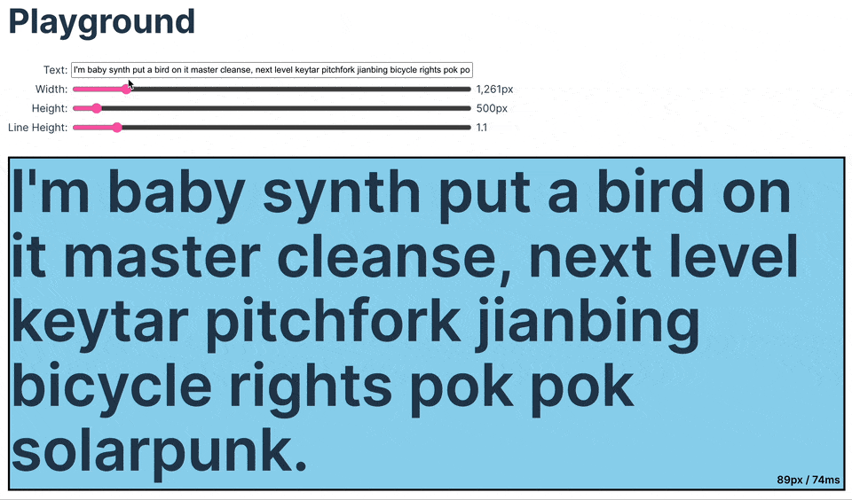

# satori-fit-text

Calculate the largest text font size that will fit a bounding box, without a web browser. Works anywhere [Satori](https://github.com/vercel/satori) does, e.g. Node.js, web browser, Vercel edge runtime, etc.



## Installation

```sh
# Using NPM
npm install @altano/satori-fit-text
# Using Yarn
yarn add @altano/satori-fit-text
# Using PNPM
pnpm add @altano/satori-fit-text
```

## Basic Example

```ts
import { findLargestUsableFontSize, type Font } from "@altano/satori-fit-text";

async function getInter(): Promise<Font> {
  const interSemiBoldBuffer = await fetch(
    `https://cdn.jsdelivr.net/npm/@fontsource/inter@5.0.17/files/inter-latin-600-normal.woff`,
  ).then((res) => res.arrayBuffer());

  const font = {
    name: "Inter",
    data: interSemiBoldBuffer,
    weight: 600,
  };
}

const largestUsableFontSize = await findLargestUsableFontSize({
  lineHeight: 1,
  font: await getFont(),
  text: "Some text I want to be as big as possible",
  maxWidth: 1136,
  maxHeight: 429,
});

console.log(largestUsableFontSize);
```

## Example Uses

- [React Component (sandbox)](https://codesandbox.io/s/altano-satori-fit-text-browser-example-j2gvk6)
- [Next.js Open Graph Card - Simple (codesandbox)](https://codesandbox.io/p/sandbox/altano-satori-fit-text-next-js-demo-sv4flc)
- [Next.js Open Graph Card - Complex](https://github.com/altano/alan.norbauer.com/blob/main/src/components/opengraph/image.tsx#L29-L35)
- [Node.js CLI App (codesandbox)](https://codesandbox.io/p/sandbox/github/altano/npm-packages/tree/main/examples/satori-fit-text-node-cli?file=%2Fpackage.json%3A1%2C1)

## Implementation

The library tries various font sizes until it finds the ideal one that works. Each iteration is tested by generating an SVG with Satori and calculating the bounding box of the SVG.

## Performance

The font size search is a binary search between 1 and 1000 with `O(log maxFontSize-minFontSize)` runtime, or a default of `O(log 1000)`. You can improve performance by restricting the search space by reducing the difference between `minFontSize` and `maxFontSize`, which reduces the number of guesses.

If you're doing something like producing Open Graph cards then you probably don't need to worry about performance.
